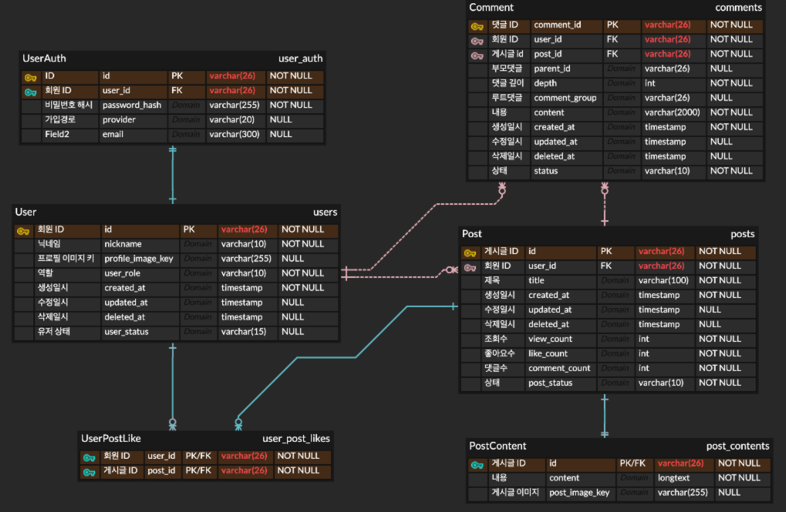

# 💾 Backend Architecture & Engineering Strategy

> **문서 개요:** 100만 MAU 트래픽 환경에서 발생할 수 있는 대량의 동시 접속과 데이터 쓰기 부하를 견디기 위한 백엔드 애플리케이션 설계 및 최적화 전략을 기술합니다.

---

## 1. Domain Model & ERD (Entity Relationship Diagram)

**대용량 트래픽을 고려한 정규화 및 인덱싱 전략**
사용자(User), 게시글(Post), 댓글(Comment), 좋아요(Likes)를 중심으로 데이터 무결성과 조회 성능의 균형을 맞췄습니다.




* **User:** JWT 기반 인증을 위한 최소한의 정보 저장
* **Post & Comment:** 1:N 관계, 페이징 쿼리 성능을 위한 인덱스 최적화
* **Likes:** 동시성 제어가 핵심인 엔티티 (Redis로 부하 분산)

---

## 2. Key Engineering Challenges & Solutions

단순한 CRUD 구현을 넘어, 고트래픽 상황에서의 병목 지점을 해결한 과정입니다.

### 🚀 Challenge 1: 좋아요(Likes) 동시성 이슈와 DB 병목 해결
> **문제 상황:** 인기 게시글의 경우 수천 명의 유저가 동시에 '좋아요'를 누를 수 있음. [cite_start]이때 RDS(MySQL)의 Row Lock 경합이 발생하여 전체 DB 성능 저하 유발 가능성[cite: 1038, 1041].

* **해결 전략: Write-Back Caching with Redis**
    1.  [cite_start]**Redis Set 자료구조 활용:** `like:users:{postId}` 키를 사용하여 중복 '좋아요' 방지 및 카운팅을 메모리에서 즉시 처리[cite: 1048, 1050].
    2.  **비동기 동기화:** Redis에 쌓인 데이터를 일정 주기 또는 임계값 도달 시 RDS로 일괄 반영(Batch Update)하여 DB 부하 최소화.
    3.  **효과:** RDS의 쓰기 부하를 획기적으로 줄이고, 사용자에게는 지연 없는 반응성 제공.

### 🛡️ Challenge 2: 인증/인가 로직의 분리 (Serverless Offloading)
> **문제 상황:** 이미지 업로드를 위해 서버를 거칠 경우, CPU/Memory 리소스가 파일 처리에 잠식됨. [cite_start]또한 단순 권한 확인을 위해 무거운 Spring Boot 서버가 개입하는 것은 비효율적[cite: 22, 23].

* **해결 전략: Lambda & Presigned URL**
    1.  [cite_start]**Lambda 분리:** 인증된 사용자에게 S3 업로드 권한(Presigned URL)을 발급하는 로직을 Node.js Lambda 함수로 분리[cite: 1181].
    2.  [cite_start]**API Gateway Authorizer:** 초기에는 Lambda 내부에서 JWT를 검증했으나, 비용 절감과 책임 분리를 위해 API Gateway단에서 인증을 먼저 처리하도록 아키텍처 개선[cite: 1206].

### 📉 Challenge 3: 대규모 데이터 조회 성능 (Query Performance)
* **No Offset Paging:** `OFFSET` 기반의 페이징은 데이터가 많아질수록 느려지므로, `Cursor` 기반(마지막 조회 ID 기준) 페이징을 적용하여 인덱스를 타도록 설계.
* [cite_start]**Read Replica 활용:** 읽기 트래픽(조회)은 Replica DB로, 쓰기 트래픽은 Master DB로 라우팅하여 부하 분산[cite: 1067].

---

# NEED TO Change
## 3. Application Architecture (Layered)

관심사의 분리(Separation of Concerns)를 통해 유지보수성과 테스트 용이성을 확보했습니다.

```text
src/main/java/com/vani/community
├── controller/       # Presentation Layer: 요청 검증 및 응답 처리
├── service/          # Business Layer: 트랜잭션 관리 및 핵심 로직
├── repository/       # Data Access Layer: JPA 및 QueryDSL 사용
├── domain/           # Entity & DTO: 데이터 모델 정의
└── common/           # Global Config: Security, Exception Handler, Utils